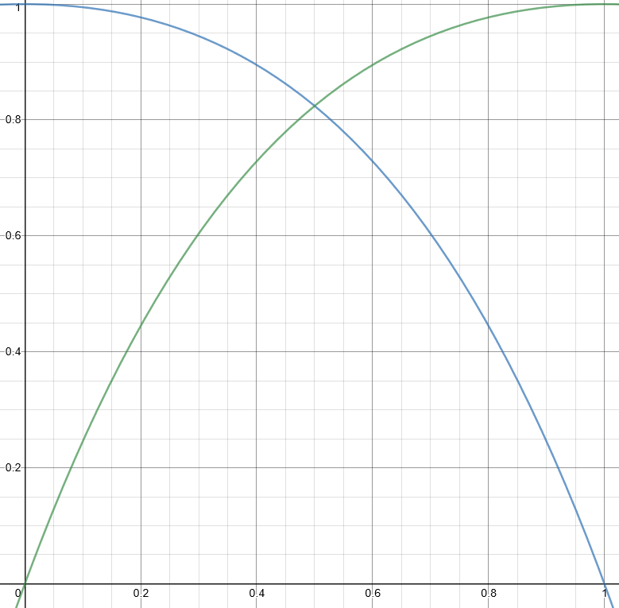
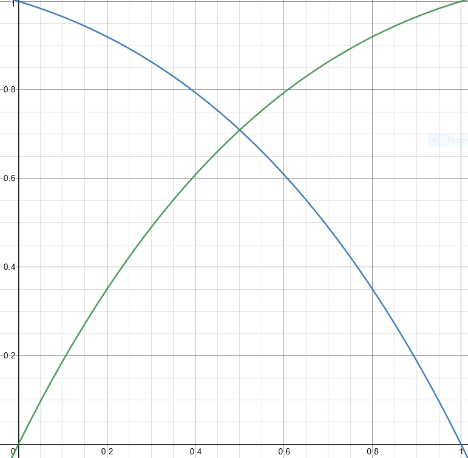
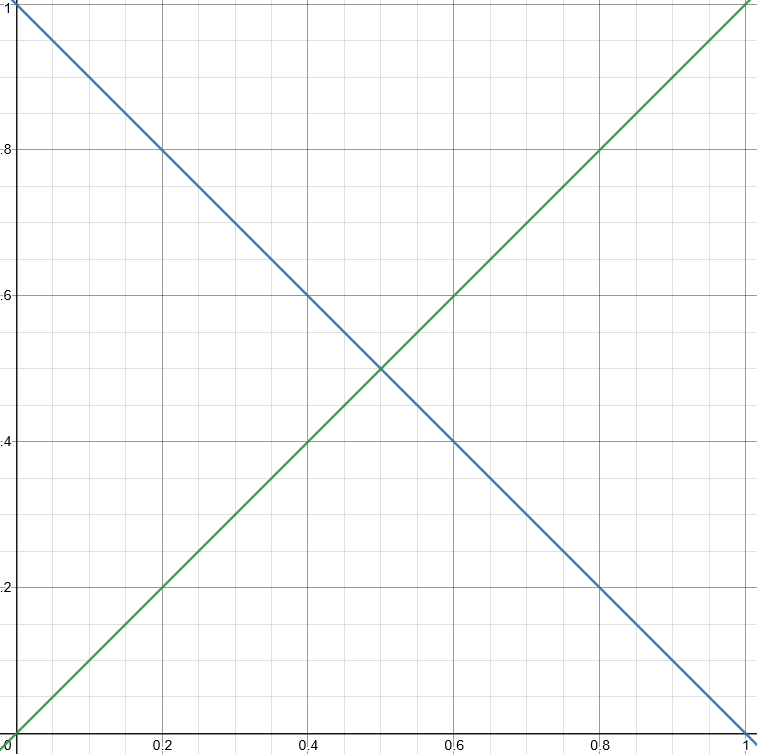
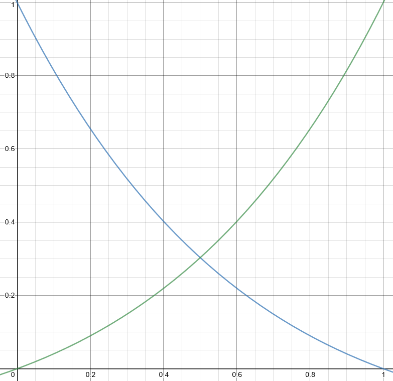

# VCV-Modules-HTLocal

Modules
* [htFader / htFader-16](#htFader)
* [htAdder](#htAdder)

## htFader

The fader is used to bring an audio signal in or out, or can alternatively also be used as CV.  
Based on a standard exponential function, the slope parameter can be used to adjust the characteristics of the fade.  
The fades can be triggered with an LED button or via trigger-in.   
Use the Fader-16 for big patches or save some CPU cycles with the 8 port version.

 
 
 
 

### inputs

When the inputs of a channel are connected the signal is used for the fades.  
If only one input is connected only the corresponding output will be active.

### outputs

Without a signal on the inputs the output will be between 0V and 10V.

### triggers

Press the buttons or provide a trigger pulse to toggle fades.

### fade time parameters

The fade in and fade out time can be set in seconds using the knobs.

### slope parameter

As indicated at the top of the column the slope parameter defines how the fade curve will "feel".
Values >1 will feel more natural, whereas values <1 will give you a fade-in that can punch though existing sounds in the frequency range earlier.
A value of 0 would be linear.

V = -1 | V = -0.7 | V = 0 | V = 1
-------|----------|-------|------
 |  |  | 

## htAdder

The htAdder is an implementation of the Doepfler A-185-2 Precision CV Adder, plus the additional feature of controlling the mode switches with a CV input.  
There are 5 CV inputs which can, depending on the mode (-/0/+) be subtracted, bypassed or added on top of each other. The resulting sequence will be sent to the output. 
If there is no input present, but a mode of either + or - is selected the switch becomes an octave switch, since the voltage for each channel (except ch.1) is +/-1V by default.

 
 

### inputs

The first input port has, other than the other 4, a default voltage of 1V * the knob value, that means a total of 0-1V when there is no input connected.  
If a signal is connected to the first input a fraction of 1V (* knob value) will be added or subtracted to / from it. This can be used as a fine tune.   

All other inputs default to a voltage of 1V or the CV that is coming in through the input. 
The fine tune knob does not work on them.  

### outputs

The output is the total of all inputs that have selected a mode other than 0 (bypass). 
There is also an inverted output port available below the original output.

### mode switch

A mode switch can have 3 states: 
0 (bypass) - Does not add or subtract the input CV or default voltage 
\+ (add) - Adds the input CV or the default voltage to the total CV 
\- (sub) - Subtracts the input CV or the default voltage from the total CV 

### mode switch CV

A mode switch can be itself controlled by CV as follows: 
0V - select bypass 
&gt;0V - select add mode 
<0V - select sub mode 
