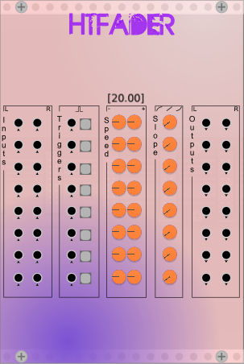

# VCV-Modules-HTLocal

## htFader

The fader is used to bring an audio signal in or out, or can alternatively also be used as CV.  
Based on a standard exponential function, the slope parameter can be used to adjust the characteristics of the fade.  
The fades can be triggered with an LED button or via trigger-in.

 
 
 
 
 
 
 
### inputs

When the inputs of a channel are connected the signal is used for the fades.  
If only one input is connected only the corresponding output will be active.

### only outputs

When the inputs of a channel are NOT connected the fade will be a voltage between 0-10V.

### fade time parameters

The first 2 knobs select the fade-in / fade-out time in seconds.

### slope parameter

Sometimes when you want to bring new sounds into a mix the threshold until you hear them can be subjectively a big higher. To compensate for that you can bring in the sound a bit earlier in the fade by adjusting the slope parameter to a value between -1 and 0.
For the opposite, to fade in slower in the beginning and faster in the end, adjust between 0 and 1.
The setting is available for every channel, defaulting to -0.7.

V = -1 | V = -0.7 | V = 0 | V = 1
-------|----------|-------|------
<image here> | <image here> | <image here> | <image here>
